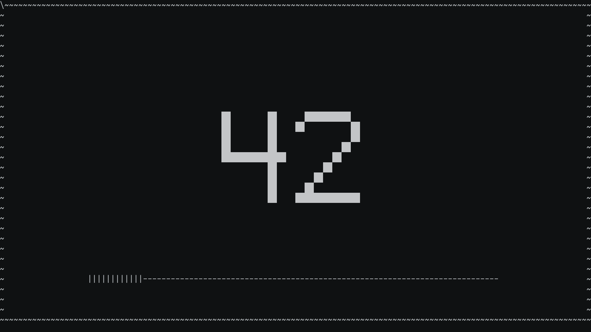
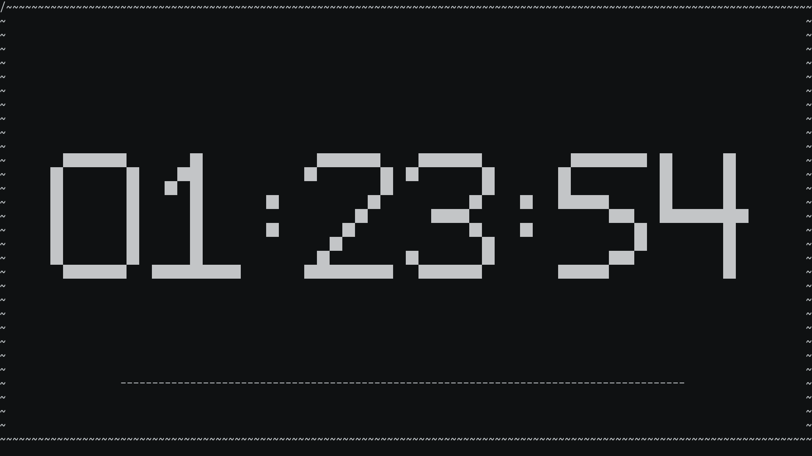

# TODO

- [x] ARGS: Parse time from args
- [x] VISUAL: Add 00:00 blinking
- [x] PAUSE: Add key 'p': Support pause
- [x] CONFIG: Add intro dialog to generate config. Support config
- [x] CONT: Support continuing last closed timer
- [x] DRAW: progress bar
- [x] INC: Add option to show increasing time
- MUSIC: Add support to play music via either MPD or direct file play.
- ~~MUTE: Add key 'm': mute music~~
